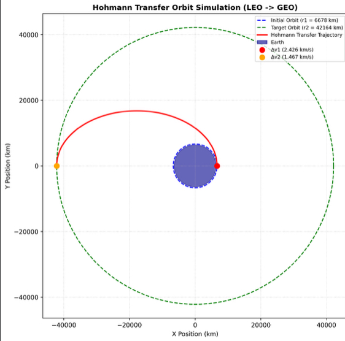

# Orbital Mechanics: Hohmann Transfer Trajectory Simulator


A Python-based orbital mechanics tool to simulate and visualize two-impulse **Hohmann Transfer Orbits** between coplanar circular orbits (LEO to GEO).

---

## Overview

The **Hohmann Transfer** is an elliptical orbit used to transfer between two circular orbits of different radii in the same plane. It represents the most fuel-efficient two-impulse maneuver under Keplerian motion assumptions.

### Key Equations

1. **Vis-Viva Equation:**
   $$v = \sqrt{\mu \left( \frac{2}{r} - \frac{1}{a} \right)}$$

2. **First Burn ($\Delta v_1$ at Periapsis):**
   $$\Delta v_1 = \sqrt{\mu \left(\frac{2}{r_1} - \frac{1}{a_{trans}}\right)} - \sqrt{\frac{\mu}{r_1}}$$

3. **Second Burn ($\Delta v_2$ at Apoapsis):**
   $$\Delta v_2 = \sqrt{\frac{\mu}{r_2}} - \sqrt{\mu \left(\frac{2}{r_2} - \frac{1}{a_{trans}}\right)}$$

---

## Results (LEO to GEO Transfer Example)

Transfer parameters from an initial altitude of **300 km (LEO)** to **35,786 km (GEO)**:

| Parameter | Value |
| :--- | :--- |
| **Initial Radius ($r_1$)** | $6,678.1 \text{ km}$ |
| **Target Radius ($r_2$)** | $42,164.1 \text{ km}$ |
| **First Impulsive Burn ($\Delta v_1$)** | $2.426 \text{ km/s}$ |
| **Second Impulsive Burn ($\Delta v_2$)** | $1.467 \text{ km/s}$ |
| **Total Required $\Delta v$** | **$3.893 \text{ km/s}$** |
| **Time of Flight** | **$5.26 \text{ hours}$** |

---

## Output Visualization



---

## How to Run

1. Clone the repository:
   ```bash
   git clone [https://github.com/inzhunauyryz/hohmann-transfer-sim.git](https://github.com/inzhunauyryz/hohmann-transfer-sim.git)
